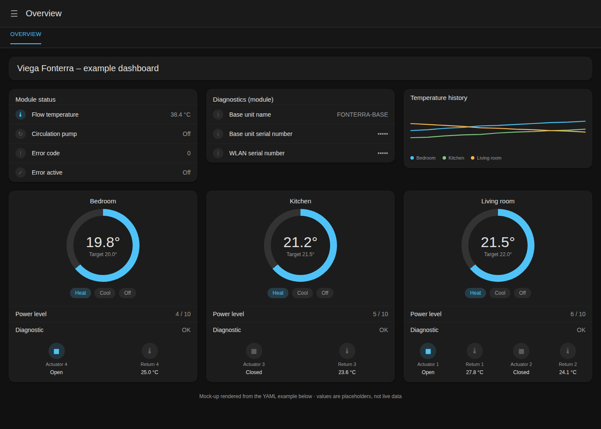

# Viega Fonterra Smart Control for Home Assistant


This custom integration connects one or more Viega Fonterra Smart Control systems to Home Assistant over local Modbus TCP. It provides room thermostats, register sensors, actuator controls, and diagnostic information.

## Features

- Multiple independently configured Viega modules
- Home Assistant UI setup and reconfiguration — no YAML editing
- Automatic room and actuator discovery straight from the device; no manual room mapping needed
- IP address or hostname and configurable Modbus TCP port
- Editable module and room names
- Room climate entities with current and target temperature
- Target-temperature writes through documented holding registers
- Operating mode and profile mode controls
- Room power-level Number entities
- Flow temperature (one shared entity per module), per-actuator return temperature, and per-actuator position (open/closed)
- Derived, debounced circulation-pump indicator for driving your own pump automation
- WLAN module and base-unit identity diagnostics
- Base-unit error code and error status
- Localized (German/English) entity names and thermostat preset labels
- Downloadable configuration diagnostics (JSON) for checking an installation against the device
- Optional Modbus TX/RX frame-level debug logging
- Transaction-ID, function-code, and response-length validation on every Modbus frame
- Preservation of the last valid value for invalid readings (`-99`) and communication failures, even across repeated consecutive errors

## Requirements

- Home Assistant with custom integrations enabled
- A Viega Fonterra Smart Control system with Modbus TCP enabled
- Network access from Home Assistant to the WLAN module or base unit

The Fonterra manual states that Modbus TCP must be enabled in the device software (via the Fonterra Smart Control web interface or app). The default endpoint used by this integration is:

- Host: `192.168.0.188`
- Port: `502` (the manual's normal/DHCP network port; `192.168.1.1` is only used in point-to-point mode)

Both values are only defaults for the setup form — use your device's actual IP address or hostname and port, and change them any time afterward through reconfiguration.

## Installation

### HACS

1. Open HACS in Home Assistant.
2. Search for **Viega Fonterra Smart Control**.
3. Install the integration.
4. Restart Home Assistant.

### Manual

Copy the `custom_components/viega_fonterra_modbus` directory into the `custom_components` directory of your Home Assistant configuration, then restart Home Assistant.

## Setup

Open **Settings > Devices & services > Add integration** and select **Viega Fonterra Smart Control**.

The setup form accepts:

| Field | Description | Default |
| --- | --- | --- |
| Host | IPv4 address or resolvable hostname of the WLAN module/base unit | `192.168.0.188` |
| Port | Modbus TCP port | `502` |
| Device name | The Home Assistant device name for this module | `Fonterra` |
| Polling interval | Seconds between Modbus reads per entity | `30` (range `5`–`300`) |
| Modbus timeout | Seconds to wait for a Modbus response | `5` (range `1`–`30`) |

The integration validates the connection before creating the entry. To add another Fonterra module (a second physical base unit), repeat the setup flow with that module's own host/port/device name — each module gets its own connection, device, polling configuration, and entities, and one module's failure or reload never affects another.

Example: two modules on the same Home Assistant installation:

| | Module 1 | Module 2 |
| --- | --- | --- |
| Host | `192.168.0.188` | `192.168.0.189` |
| Port | `502` | `502` |
| Device name | `Fonterra Erdgeschoss` | `Fonterra Obergeschoss` |
| Polling interval | `30` | `30` |
| Modbus timeout | `5` | `5` |

There is no room-mapping field on this form. Rooms and their actuator(s) are
discovered automatically from the device itself once it connects: the
integration reads every actuator's "Raum ID" register to see which room it
serves, and each room's own name register for its display name. This runs
again on every setup/reload, so it reflects the physical installation even
if it changes later (an actuator moved to a different room, a room renamed
on the base unit). If the device can't be reached during a particular setup
cycle, the last successfully discovered mapping is kept instead.

If discovery has never succeeded even once (for example, the device was
unreachable during the very first setup), no room, climate, or Number
entities are created and a warning is logged — there is currently no way to
type in a room mapping from scratch through the UI as a substitute. Make
sure the device is reachable and Modbus TCP is enabled before adding the
module, and reload the integration entry once it is.

Room names are used for climate, Number, sensor, and diagnostic entity names.

## Reconfiguration

Open the integration entry and select **Configure** to change the module's device name, host, port, polling interval, and Modbus timeout. For every room the device has already reported, you can also override its display name, actuator number, sensor number, and target-temperature register. The connection is tested before changes are accepted, and the integration reloads the module automatically after a successful change (which re-runs discovery and may overwrite a manual override if the device now reports something different for that room).

Entity unique IDs are based on the config entry and room ID, so renaming a module or room does not create duplicate entities.

## Entities

Depending on the discovered rooms/actuators and available registers, the integration creates (device/room names below are examples — yours will use your own configured names):

| Platform | Example entity ID | What it shows |
| --- | --- | --- |
| Climate | `climate.fonterra_wohnzimmer` | Current/target temperature, heating/cooling mode, profile mode |
| Number | `number.fonterra_wohnzimmer_power_level` | Room actuator power level (`0`–`10`) |
| Sensor | `sensor.fonterra_flow_temperature` | Base-unit flow temperature (one entity per module) |
| Sensor | `sensor.fonterra_wohnzimmer_actuator_1_return_temperature` | One actuator's return temperature |
| Binary sensor | `binary_sensor.fonterra_wohnzimmer_actuator_1_position` | One actuator's position (open/closed) |
| Sensor | `sensor.fonterra_wlan_serial_number` / `..._base_unit_serial_number` / `..._base_unit_name` | Diagnostic identity values |
| Sensor | `sensor.fonterra_base_unit_error_code` | Raw base-unit error code + description |
| Binary sensor | `binary_sensor.fonterra_base_unit_error` | On when the base-unit error code is non-zero |
| Sensor | `sensor.fonterra_wohnzimmer_diagnostic` | Textual communication status for that room |
| Binary sensor | `binary_sensor.fonterra_circulation_pump` | Derived circulation-pump indicator (see below) |

Operating mode and profile mode are set on the base unit itself, not per
room — changing them from any one room's thermostat card changes them for
every room at once. This matches the physical device (there is only one
Betriebsmodus/Profilmodus register for the whole installation) and is not a
bug.

The Fonterra register map uses signed 16-bit input values. Temperatures are scaled according to the manual: room and target temperatures use tenths of a degree Celsius, as do flow and return temperatures. The integration converts these values before exposing them to Home Assistant.

### Circulation pump indicator

`binary_sensor.<device>_circulation_pump` (one per module, device class "running") is a **derived** indicator, not a device register — the Fonterra base unit has no circulation-pump register at all. It is:

- **on** when at least one of the module's used actuators (one actually assigned to a room by discovery) is confirmed open
- **off** once every used actuator is confirmed closed
- **unknown/unavailable** until the first actuator has settled

Every actuator's raw open/closed reading is debounced before it can affect this entity: a reading only counts once the actuator's position register has returned the *same* value on 3 consecutive reads, so a single noisy or transitional reading cannot flip the pump. A failed read or a `-99` value is skipped — it neither advances nor resets that actuator's debounce counter.

This entity writes nothing back to the device and does not control anything on the Fonterra system. It is meant to drive your own automation for a circulation pump that is wired and switched independently (e.g. via a smart relay):

```yaml
automation:
  - alias: "Heizkreispumpe folgt Fonterra-Aktoren"
    trigger:
      - platform: state
        entity_id: binary_sensor.fonterra_circulation_pump
    condition:
      - condition: template
        value_template: "{{ trigger.to_state.state in ['on', 'off'] }}"
    action:
      - service: switch.turn_{{ 'on' if trigger.to_state.state == 'on' else 'off' }}
        target:
          entity_id: switch.heizkreispumpe
```

## Example dashboard

A minimal Lovelace overview built entirely from Home Assistant's built-in
cards (`thermostat`, `entities`, `glance`, `history-graph`, `markdown`) — no
HACS frontend cards required. It fits one module with a handful of rooms on
a single view: module-wide status and diagnostics at the top, one block per
room below, and a combined temperature history at the end.



This is a mock-up built to illustrate the layout, not a live screenshot —
render the YAML below against your own entities to see your actual values.

Every entity ID below follows the pattern already used in
["Entities"](#entities) above: `<domain>.<device_name>_<room_name>[...]`. The
example uses the default device name `fonterra` and three generic room
names (`bedroom`, `kitchen`, `living_room`, the last one with two actuators
to show the multi-actuator case) — replace both with your own device and
room names. You can look up your exact entity IDs under **Developer tools →
States**, filtered by your device name.

```yaml
title: Heating
views:
  - title: Overview
    path: heating-overview
    icon: mdi:radiator
    cards:
      # Header
      - type: markdown
        content: "## Viega Fonterra – <device_name>"

      # Module-wide status (one of these per module)
      - type: entities
        title: Module status
        entities:
          - entity: sensor.<device_name>_flow_temperature
            name: Flow temperature
          - entity: binary_sensor.<device_name>_circulation_pump
            name: Circulation pump
          - entity: sensor.<device_name>_base_unit_error_code
            name: Error code
          - entity: binary_sensor.<device_name>_base_unit_error
            name: Error active

      - type: entities
        title: Diagnostics (module)
        entities:
          - entity: sensor.<device_name>_base_unit_name
          - entity: sensor.<device_name>_base_unit_serial_number
          - entity: sensor.<device_name>_wlan_serial_number

      # One block per room — copy this vertical-stack for each room
      - type: vertical-stack
        cards:
          - type: thermostat
            entity: climate.<device_name>_<room_name>

          - type: entities
            title: <Room name> details
            entities:
              - entity: number.<device_name>_<room_name>_power_level
                name: Power level
              - entity: sensor.<device_name>_<room_name>_diagnostic
                name: Diagnostic

          - type: glance
            title: <Room name> actuator(s)
            entities:
              - entity: binary_sensor.<device_name>_<room_name>_actuator_<N>_position
                name: Actuator <N>
              - entity: sensor.<device_name>_<room_name>_actuator_<N>_return_temperature
                name: Return <N>
              # a room with more than one actuator (spec.md 4) repeats this
              # pair of lines once per actuator number

      # Repeat the vertical-stack block above for every other room ...

      # Compare every room's temperature over time
      - type: history-graph
        title: Temperature history
        hours_to_show: 24
        entities:
          - entity: climate.<device_name>_<room_name>
          # add the remaining rooms here
```

Filled in for three rooms — a single-actuator `bedroom` and `kitchen`, and a
`living_room` with two actuators (actuator numbers are illustrative; use the
ones your own installation actually discovered):

```yaml
title: Heating
views:
  - title: Overview
    path: heating-overview
    icon: mdi:radiator
    cards:
      - type: markdown
        content: "## Viega Fonterra – Fonterra"

      - type: entities
        title: Module status
        entities:
          - entity: sensor.fonterra_flow_temperature
            name: Flow temperature
          - entity: binary_sensor.fonterra_circulation_pump
            name: Circulation pump
          - entity: sensor.fonterra_base_unit_error_code
            name: Error code
          - entity: binary_sensor.fonterra_base_unit_error
            name: Error active

      - type: entities
        title: Diagnostics (module)
        entities:
          - entity: sensor.fonterra_base_unit_name
          - entity: sensor.fonterra_base_unit_serial_number
          - entity: sensor.fonterra_wlan_serial_number

      # --- Bedroom (1 actuator) ------------------------------------------
      - type: vertical-stack
        cards:
          - type: thermostat
            entity: climate.fonterra_bedroom
          - type: entities
            title: Bedroom details
            entities:
              - entity: number.fonterra_bedroom_power_level
                name: Power level
              - entity: sensor.fonterra_bedroom_diagnostic
                name: Diagnostic
          - type: glance
            title: Bedroom actuator
            entities:
              - entity: binary_sensor.fonterra_bedroom_actuator_4_position
                name: Actuator 4
              - entity: sensor.fonterra_bedroom_actuator_4_return_temperature
                name: Return 4

      # --- Kitchen (1 actuator) -------------------------------------------
      - type: vertical-stack
        cards:
          - type: thermostat
            entity: climate.fonterra_kitchen
          - type: entities
            title: Kitchen details
            entities:
              - entity: number.fonterra_kitchen_power_level
                name: Power level
              - entity: sensor.fonterra_kitchen_diagnostic
                name: Diagnostic
          - type: glance
            title: Kitchen actuator
            entities:
              - entity: binary_sensor.fonterra_kitchen_actuator_3_position
                name: Actuator 3
              - entity: sensor.fonterra_kitchen_actuator_3_return_temperature
                name: Return 3

      # --- Living room (2 actuators) ---------------------------------------
      - type: vertical-stack
        cards:
          - type: thermostat
            entity: climate.fonterra_living_room
          - type: entities
            title: Living room details
            entities:
              - entity: number.fonterra_living_room_power_level
                name: Power level
              - entity: sensor.fonterra_living_room_diagnostic
                name: Diagnostic
          - type: glance
            title: Living room actuators
            entities:
              - entity: binary_sensor.fonterra_living_room_actuator_1_position
                name: Actuator 1
              - entity: sensor.fonterra_living_room_actuator_1_return_temperature
                name: Return 1
              - entity: binary_sensor.fonterra_living_room_actuator_2_position
                name: Actuator 2
              - entity: sensor.fonterra_living_room_actuator_2_return_temperature
                name: Return 2

      - type: history-graph
        title: Temperature history
        hours_to_show: 24
        entities:
          - entity: climate.fonterra_bedroom
          - entity: climate.fonterra_kitchen
          - entity: climate.fonterra_living_room
```

Remember that `hvac_mode` and `preset_mode` are shared across every room of
the same module (see "Entities" above): the thermostat card's mode buttons
change them for the whole module, whichever room's card you use.

## Verifying your configuration

Two built-in ways to check that the integration resolved your installation correctly, without editing any files:

- **Settings → Devices & services → Viega Fonterra Smart Control → (module) → Download diagnostics** exports a JSON file with the module's identity (serial numbers, base-unit name) and every discovered room's name, id, and actuator(s) with the exact register addresses each one resolves to. The host address is redacted.
- [`RegisterMap.md`](RegisterMap.md) in this repository lists every documented register address from the manual and which entity reads/writes it, so you can cross-check the diagnostics export against the manual by hand.

## Modbus debug logging

Frame logging is disabled by default and has exactly one switch: the Home Assistant logger level for this integration's Modbus transport. In `configuration.yaml`, set:

```yaml
logger:
  default: info
  logs:
    custom_components.viega_fonterra_modbus.modbus: debug
    custom_components.viega_fonterra_modbus: debug
```

With that enabled, every transmitted (`TX`) and received (`RX`) frame appears in the Home Assistant log (or **Settings → System → Logs**) with direction, host, port, frame length, transaction ID, unit ID, function code, and the complete frame in hexadecimal. The second logger line (`custom_components.viega_fonterra_modbus`, without `.modbus`) additionally logs the resolved room/actuator topology on every setup — which room a given actuator was assigned to and which registers back each of its entities — useful for cross-checking against the physical installation. Do not leave either enabled permanently on a busy installation — they log a line for every single register read/write.

## Troubleshooting

### Connection failed

Check that Modbus TCP is enabled in the Fonterra software and that Home Assistant can reach the configured host and port. The default endpoint used by the setup form is `192.168.0.188:502`; use your device's actual address if it differs.

### No rooms, climate, or Number entities were created

This means automatic discovery has never succeeded for this module (see "Setup" above) — check the Home Assistant log for the warning from `custom_components.viega_fonterra_modbus`, confirm the device is reachable and Modbus TCP is enabled, then reload the integration entry (three-dot menu on the entry → Reload).

### Values are unavailable or show as `-99`

A register value of `-99` means the device itself considers the value unavailable (for example, no room thermostat is paired for that room). The integration keeps the previous valid value and exposes the communication problem through the room's diagnostic entity. Cross-check the affected room/actuator's register addresses using "Verifying your configuration" above.

### Changing the mode/preset in one room changes it everywhere

Expected — see "Entities" above: operating mode and profile mode are one shared register per base unit, not per room.

### A module won't delete, or the integration entry's "Delete" seems to hang

Removing a module always succeeds, even when its device is offline or unreachable — the socket close is time-bounded to the module's configured Modbus timeout. The device can also be removed from its own device page (Settings → Devices & services → Devices → the module), not only from the integration entry.

### Preset labels ("Manuell"/"Profil"/"Absenkbetrieb") show in English

Home Assistant loads entity translations once per language/session; reload the browser tab (or restart Home Assistant after upgrading the integration) if labels look stale after an update.

### Home Assistant reports an integration or platform error

Restart Home Assistant after installing or upgrading the integration. Confirm that `manifest.json` contains `config_flow: true` and that the integration is located at `custom_components/viega_fonterra_modbus/`.

## Reporting an issue

Please open an issue at the [issue tracker](https://github.com/mikefogel/homeassistant-viega-fonterra-modbus/issues) with:

1. **The integration version** — `manifest.json`'s `version`, also shown on the integration's page under Settings → Devices & services.
2. **Your Home Assistant version** — Settings → System → General.
3. **A short description of what you expected vs. what actually happened**, including which room/entity is affected.
4. **The diagnostics export** for the affected module — see "Verifying your configuration" above ("Download diagnostics"). It contains the resolved room/actuator topology and register addresses, with the host redacted; please still remove anything else you consider sensitive (e.g. serial numbers) before attaching it if you'd rather not share them.
5. **A debug log excerpt** covering the problem, if it's about a specific read/write or about discovery — see "Modbus debug logging" above for how to enable it. A few seconds around the relevant TX/RX frames is usually enough; you don't need to attach a full log.
6. **The relevant page(s) of the Viega manual**, if you believe a register address or behavior differs from what `spec.md`/`RegisterMap.md` document, so it can be checked against the source.

Bug reports that come with a diagnostics export and/or a debug log excerpt are much faster to act on than a description alone, since register addresses and topology issues are otherwise hard to reproduce without your exact hardware.

## Icon / branding

[`brands/custom_integrations/viega_fonterra_modbus/`](brands/custom_integrations/viega_fonterra_modbus/) contains `icon.png`/`icon@2x.png` (and dark-theme variants) — an original underfloor-heating design (warmth rising from a floor, not the Viega logo or any other vendor's), laid out exactly as the [home-assistant/brands](https://github.com/home-assistant/brands) repository expects for `custom_integrations/viega_fonterra_modbus/`. Home Assistant's own UI (Settings → Devices & services) only shows a custom integration's icon once that repository has merged it; these files are ready to submit there as a pull request but have not been submitted yet, so the icon won't appear there until that happens — it does already show up wherever this repository's own files are rendered directly (this README, HACS's repository listing).

## Documentation

- [System specification](spec.md)
- [Register address map](RegisterMap.md)
- [Viega Fonterra Smart Control manual](https://www.viega.de/content/dam/viega-assets/viega-worldwide-assets/products/surface-tempering/fonterra-smart-control/technical-documents/instructions-for-use/Fonterra%20Smart%20Control-de-DE.pdf) (hosted by Viega, see "Third-party documentation" below)
- [Home Assistant documentation](https://www.home-assistant.io/)

## Third-party documentation

This repository's own MIT license (below) covers only the integration's code and documentation. The Viega Fonterra Smart Control manual is © Viega and is not distributed with this repository — it is linked, hosted on Viega's own site, under "Documentation" above.

## License

MIT. See [LICENSE](LICENSE).
